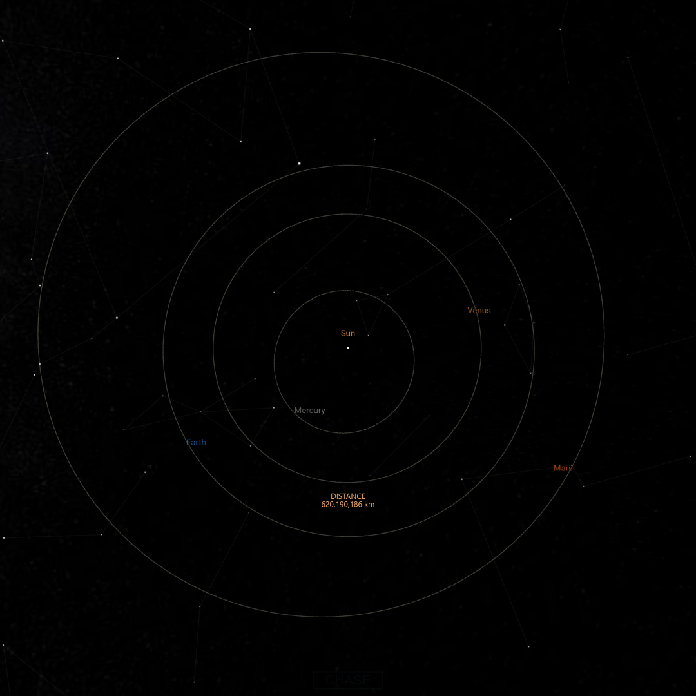
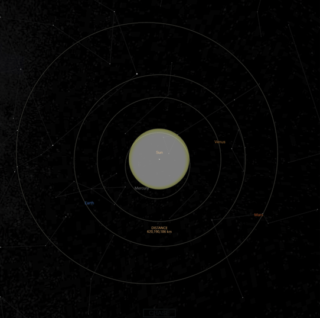
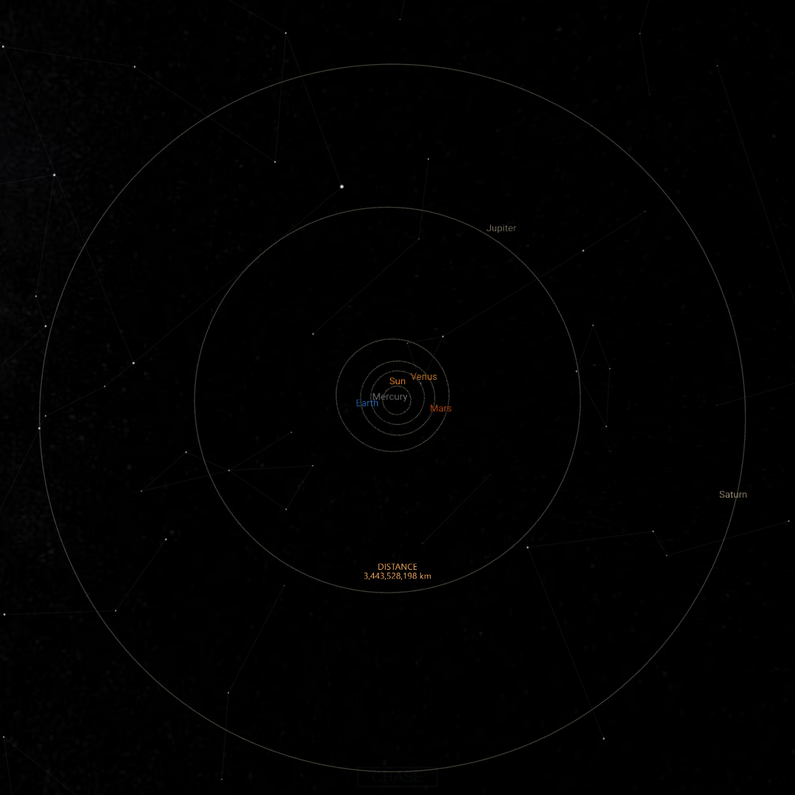
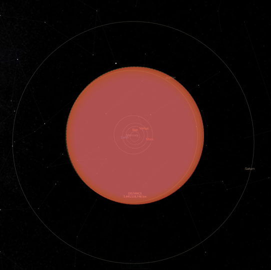

# Astrolibrary

### Description:
This program is merging my passion for *astronomy*, *astrophysics* and the *night sky* with my new found skills of programming.
It is also officially **my very first project** after learning Python for 2 months.

The Astrolibrary has three main features:

* Show information about a star (how big and far away is Betelgeuse?)
* Compare between two stars (how big is Betelgeuse compared to the North star?)
* Replace our sun with another star to see how big it would be in our solar system **_to scale_**.

*The program uses information about the stars from [The Internet Stellar Database](http://www.stellar-database.com/) through web-scraping,
credits to Roger M. Wilcox. It also has pictures from [Spacein3D Universe Sandbox](https://spacein3d.com/universe-sandbox/), website.*

### Installation

It only requires 3 libraries outside the ones already in python.

````console
pip install requests
pip install prettytables
pip install pillow
````
Download the folder and run astrolibrary.py.

### Table of contents

- How does it work?
    - Feature One, Star information
        - *Why web-scraping?*
    - Feature Two, Star comparisons
    - Feature Three, The Planetarium, solar system scale model

- How is the scale model calculated?
- Functions
- Notes of improvements

### How does it work?

The program is simple enough when you start it that no explanation is really needed to navigate and understand what it does, but if you want to dive deeper here it goes. *You might find the planetarium quite interesting.*

#### Star information

The first feature, to show information of a star is quite simple.
When you enter the name of a star, the program will web scrape from [The Internet Stellar Database](http://www.stellar-database.com/) using regular expression to find the information I decided was relevant. That is, *name*, *distance*, *size*, *star type*, type of *starsystem*, *mass* and *apparent visual magnitude* (how easy/hard it is to see with the naked eye).

````console
Enter a star name: Polaris
````

Its case-insensitive when entering a star name. Its no problem if the star name has white-space. After you have entered a star's name, in this case the North Star aka Polaris, it will output a table with the information about it.

````console
+---------+---------------+---------------+----------+-------------+---------------+------------------+
|   Name  | Distance (LY) | Size (x Suns) | Startype | Star System | Mass (x Suns) | Visual Magnitude |
+---------+---------------+---------------+----------+-------------+---------------+------------------+
| Polaris |     431.0     |      43.9     |    F7    |    Binary   |      1.5      |      +2.10       |
+---------+---------------+---------------+----------+------------- +---------------+-----------------+
````
Some of the values are formatted to be relative to the sun. This is because writing their true size in km/miles will just be a bunch of large numbers, not really helping to gauge the magnitude of these celestial behemoths. Its easier to understand when we compare them to an object we are somewhat familiar with.

*Why web-scraping?*

My go-to was trying to find an API with all the relevant information. After hours I couldn't find one and decided to take information directly from the HTML of a website using the *requests* library as a brute-force method.

Wikipedia could work but making it reliable through regular expression would deem way too hard.

SIMBAD was another website that is used professionally in the astronomy scene, but I simply couldn't understand it.

[The Internet Stellar Database](http://www.stellar-database.com/) was perfect for my use. 
The url of the site was very simple. When searching for different stars only the star name changed and not the rest of the url, which made it a lot easier to search with it using code. 

Meaning, I could write code like this:

```ruby
star = input("Enter a star name: ")

response = requests.get(f"http://www.stellar-database.com/Scripts/search_star.exe?Name={star}")
```
Where in the end, I could just format string the return value of input directly into the url.

Though the downside is that its relatively old, having information from the early 2000's.
Astronomy is evolving after each new instrument implemented, so its data is outdated. 

But after fact-checking I realized that most information is roughly the same today and varies from star to star. Its only the star distances that is on the low-end. For example, the information on Polaris is totally accurate, but on Betelgeuse its slightly wrong. The site says it is 427 light-years away but today's figures says its between 600 - 700 light-years away. To the sites defence, all the other information is accurate.

#### Star comparison

You will be prompted to enter the names of two stars.

````console
Enter the first star: Polaris
Enter the second star: Betelgeuse
````

It will then in the same way, search information on both of those stars, retrieve it and output a table now with both stars visible.

````console
+------------+---------------+---------------+----------+-------------+---------------+------------------+
|    Name    | Distance (LY) | Size (x Suns) | Startype | Star System | Mass (x Suns) | Visual Magnitude |
+------------+---------------+---------------+----------+-------------+---------------+------------------+
|  Polaris   |     431.0     |      43.9     |    F7    |    Binary   |      1.5      |      +2.10       |
| Betelgeuse |     427.0     |     662.0     |    M2    |    Binary   |      20.0     |      +1.30       |
+------------+---------------+---------------+----------+-------------+---------------+------------------+
Polaris is 1.01 times farther away than Betelgeuse.
Betelgeuse is 15.08 times bigger than Polaris.
Betelgeuse is 13.33 times more massive than Polaris.
````

But, it will also add an descriptive text to emphasize differences. The one greater than the other in the specified value will always be mentioned first.

I made sure to include 2 digits, because otherwise the first sentence would read "Polaris is 1.0 times farther away than Betelgeuse." which wouldn't make much sense.

I also include corner cases. There are times when the website I use doesn't have values for the things I need. 
To fix this, I assigned all variables with "?" from the beginning, and if the regex found something, it would be replace with the designated value.
In the star comparisons it looks like this:


````console
Enter the first star: Dubhe
Enter the second star: Etamin
````


````console
+----------------+---------------+---------------+----------+-------------+---------------+------------------+
|      Name      | Distance (LY) | Size (x Suns) | Startype | Star System | Mass (x Suns) | Visual Magnitude |
+----------------+---------------+---------------+----------+-------------+---------------+------------------+
|     Dubhe      |     124.0     |      30.4     |    K0    |    Binary   |       ?       |      +1.87       |
| Gamma Draconis |     148.0     |      58.9     |    K5    |   Singular  |       ?       |      +2.23       |
+----------------+---------------+---------------+----------+-------------+---------------+------------------+
Gamma Draconis is 1.19 times farther away than Dubhe.
Gamma Draconis is 1.94 times bigger than Dubhe.
-Not enough information to compare mass-
````

Also notice that I entered "Etamin" for the second star, but the output is "Gamma Draconis".
The website has aliases for all the stars, but I coded it to use the first one, meaning if you use a less popular name for a star, the primary one will be used for you.

#### The Planetarium, solar system scale model

I was very pleased that I made this work. I knew I wanted it and knew it was possible, but didn't really know how to do it.

The final feature and most ambitious, is what I call the "Planetarium". Here you can enter a star of your choice and it will show you an image of the solar system with the sun replaced with your star *to scale*. I have a margin of error of 1-5 pixels. *More on why later.*

I took 3 screenshots of the solar system from [Spacein3D Universe Sandbox](https://spacein3d.com/universe-sandbox/) with 3 different levels of zoom. I also took an image of a free png page of a white/yellow circle that would act as the star.

The program will then resize the star image to the relative size of the star you entered and pasted upon the solar system screenshot to scale.
I have 3 different zooms for small, medium and large stars that I have made conditionals for when each one should be used.

*How exactly this is done to be to scale and accurate will be explained in a different section.*

You will be prompted to enter a star.

````console
Enter a star to replace our sun: Polaris
````

The diameter ranges (x times the sun) are < 231, between 231 and 1300 and lastly 1300 >.

Polaris is in the low end, so the first zoom of the solar system image will be used. It will then calculate and resize the star img to match Polaris, and pasted onto the solar system. It looks like this for Polaris:

**Before**



**After (Polaris)**



The star image is slightly transparent so you can see what is behind it and gauge scale a little better.
The image returned is using the *pillow* library. The command to show the image is image.show() so the picture is not saved on your computer and is only temporary.

If you did this for a larger star, like Betelgeuse it would then use the second zoom, recalculate and resize the image to fit.

**Before**



**After (Betelgeuse)**



The colour of the star is also determined by the startype. 
 - M types = Red
 - K types = Orange
 - G and F types = Yellow/white
 - A, B and O types = Blue

M types are the least hot, O types are the hottest.

The planterium is reusable and doesn't affect the original images.
It also tells you if the replacing went through without issue and reprompts you if the star doesn't exist or if the size information couldn't be retrieved.

### How is the scale model calculated?

This is where my head-scratching began. It took a long time to figure out a way to go about this. Where should I grab the pictures? Should I make 20 different pictures with the stars already inserted and then make ranges from when which one should be used? That would take way too much time.

I wanted something that always works, is future-proof and more importantly, *accurate* and *to scale*. So after finding good pictures, how is the resizing calculated?

*First off*, the pictures of the solar system are **100% accurate** regarding the orbits and their **relative distances** to eachother.
The pictures are formatted to 1080x1080. The Sun is also **directly centered** in the middle, thanks to the website I used.

Straight off I knew that if I could match the star image with a *known size on the picture* (like Earth's orbit which is known) I could from there calculate how large each pixel would be in the "real world".

I manually tweaked the size of the star img to be the same size as the orbit of Earth according to the solar system picture. This was done by eye. It turned out to be (1000, 1000) when the star image lined up.
Then, I looked up what the size of Earth's orbit actually is. 299,200,000 km.

This means (1000, 1000) is exactly 299,200,000 km. Divide 299,200,000 by 1000 and you get 299,200.

*The size of 1 pixel is therefore 299,200 km.*
Then you have to do this for all 3 pictures, as the real world sizes are different. Meaning the pixel size of 299,200 is only true for the first zoom.

When you have the pixel size its easy to convert the stars size. Take the star's size in kilometers and divide it by the pixel size, 299,200 and you know how many pixels that star will be.

For example, Polaris size is 43.9 times the sun. The sun's diameter is 1,391,000 km. 1,391,000 times 43.9 is 61,064,900. Then divide it by the pixel size, 61,064,900 / 299,200 = 204.1. Then you know that star image size of (204, 204) is the size of Polaris.

*How to center the actual picture is explained in the functions section.*

### Functions

The program has 4 functions.

* starinfo(s)
* is_bigger(x, y)
* diameter(n)
* imsize(n)

```python
def starinfo(s):
```

This functions takes as an argument the name of the star inputted by the user. It will then search for the star in the database, use regular expressions to find the information I want and then reformat them so its understandable for the average person. 

This is for example how I get the distance of a star from the website:
```python
if disfromsol := re.search(r"Distance from Sol:</B> (\d+(?:.\d+)?)", web):
        _ = disfromsol.group(1)
        distance = round(float(_), 1)
```
That was relatively easy, but some were a pain to get right. For example, this is the code just to see what type of star system the star is in. Meaning, a binary (double star system) or a triple (triple star system).

```python
if arity := re.search(r"Arity:</B> ([1-9a-zA-Z, ]*)", web):
        starsystem = arity.group(1)
        if "singular" in starsystem:
            starsystem = "Singular"
        if "binary" in starsystem:
            starsystem = "Binary"
        if "trinary" in starsystem:
            starsystem = "Triple"
        if "quarternary" in starsystem:
            starsystem = "Quadruple"
        if "quinary" in starsystem:
            starsystem = "Quintuple"
        if "hexary" in starsystem:
            starsystem = "Sextuple"
```
The site used the word "arity" for star system, and it also used a not so user-friendly way of saying how many stars there were in the system. I had to manually look through all the different ways it decided to name star system, and replace them with the ones more commonly used.

It will then return all values in a list. This function is used everytime the user inputs a star.

```python
return [names, distance, size, startype, starsystem, mass, apparent]
```
This function also error checks. Sometimes the site doesn't have a value for a specific variable. To not make regex call an error, I assign all variables before hand into "?".

```python
names = distance = size = startype = starsystem = mass = apparent = "?"
```
When the values are then returned I can print the "?" like normal, showing that no information was found about it.

It also handles if the star you write isn't found. Either by typo or it not existing at all.

The website will show two different pages depending on the error.

If you write for example "r" it will show all stars starting with r. If you write for example "rig", it will show all stars starting with "rig".
But if the amount of stars that it recommends to you are more than 50, that is one page, less than 50, that is another page. The code handles that.

```python
if "No star name matching" in web or "found with a name matching" in web:
        return ["Star", "not", "found", "in", "the", "database."]
```
It was a lot of testing to see what sentences worked without matching in an actual star result and only when the star wasn't found. It will return a list for a reason. Because it returns a list when a star is found, I index into that list to get the variables I need. But, if no star is found I still want to return a list so that the code doesn't get ruined. I then do the following to error check in the code, not in the function:

```python
first = input("Enter the first star: ").strip().lower().replace(" ", "+")
star1 = starinfo(first)
if "Star" in star1:
    print(*star1)
else:
    break
```
Only the error message from the function will have "Star" in it. So if it does I unpack it and it will print "Star not found in the database", allowing you to reprompt.

This is important because I unpack a list when making the tables.
```python
star_t = PrettyTable(["Name", "Distance (LY)", "Size (x Suns)", "Startype", "Star System", "Mass (x Suns)", "Visual Magnitude"])
# Unpacking the entire return value of variables into the row.
star_t.add_row([*info])
```
This way I wont have to change much code to error check.

```python
def is_bigger(x, y):
```
When these explanatory sentences are used during star comparisons I have to check which of the two stars values are bigger than the other.

Before arguments are passed in I have seperated the two stars distances, sizes and masses into their own variables.

The distance from star 1 is the passed in as "x" and the distance from star 2 as "y". The function then returns the following things:

* If x > y, return True
* If y > x, return False
* If x and y are the same size, return "0"
* If x or y contains "?", return "x"

With this I can know in the code which one of the values is bigger and make sure the explanatory messages only choose the one greater than the other. Like this:
```python
if is_bigger(siz1, siz2) == True:
    n1 = siz1 / siz2
    print(f"{fstar[0]} is {n1:.2f} times bigger than {sstar[0]}.")
    # fstar is the entire list of variables from the first star.
    # sstar is the entire list of variables from the second star.
```
This is done for all three variables, distance, size and mass for all four different outcomes of the is_bigger() function.

```python
def diameter(n):
    return round(n * 1391400, 3)
```
**Planetarium function.** Very simple function. It takes the stars size as an argument. Because all the variables are relative to the suns size, this function simply returns the true size of the stars in km's.

```python
def imsize(n):
```
**Planetarium function.** This function is used to calculate what the stars image sized should be, to be completely centered on the solar system scale images. When pasting an image using the *pillow* library, the coordinate system works in the way that it *always* refers to the upper-left corner as (0,0) meaning it *does not operate from the center*.

In the "*How to calculate the scale model*" section, we see how to get the correct star image pixel size. For Polaris that was (204, 204). But this function calculates how to position (204, 204) to be exactly centered. The solar system images are formatted to 1080x1080. The center of that would be (540, 540). But if you would paste an image exactly at (540, 540), **the upper left corner of your image will be pasted unto (540, 540), not the center of it.**

Meaning, **you have to paste the center of your resized star image**, unto the center of the solar system image.

This is the full function:
```python
def imsize(n):
    # Because all the solar system images are 1080x1080, the center is 540x540
    size = 540 - (n / 2)
    size1 = round(int(size))
    return (size1, size1)
```
For Polaris, the function would be:
```python
def imsize(204):
    # Because all the solar system images are 1080x1080, the center is 540x540
    size = 540 - (204 / 2)
    size1 = round(int(438))
    return (size1, size1)
            # (438, 438)
```
The first part, size = 540 - (n / 2). The reason you divide n by 2 is to get the center of the star image. (204, 204) is the full image of the resized Polaris. But because we want to find the center of the star image, half of that would be the center. Remember that we always start from the upper-left, so 204 would be the diameter of the image, and half of that, 102, the radius, goes to the center.

Now we subtract that to the center of the solar system image. *Why?* Because if we position the upper-left corner of the star image on the solar system image at (438, 438), the star image will start there with its upper-left corner and the center of the star image will lined up with the center of the solar system image.

The return value will be a two-argument tuple, which the Image() class requires when using the Image.paste function to decide where the image should be pasted.

### Notes of improvements

If I want to continue with this project further, here are a few things I could do to improve the program.

* Get a better database, either another website or preferably a good API.
* Additional zooms on the solar system images, so there is more variety and accuracy to the star sizes.
* A different colour star image depending on the star, because the startype actually tells you what the star's colour would be. *(Added 03/05-2024)*
* More reprompting options. *(Added 29/4-2024)*
* A GUI, but I dont know that kind of code yet.

Other than that, I am proud of what I've accomplished on my very first project after learning Python and even programming in general after two months. I noticed that this was a whole lot easier when its about something you're truly passionate about. 

#### *Keep looking up.*

**This project all-in-all took me one week, about 20 hours, 15 of which was coding related.**

(*Not including the extra improvements afterwards*)
